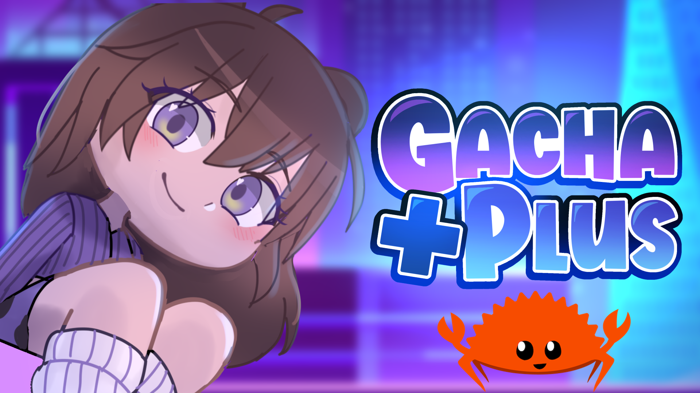

# Gacha Plus Rust API
   

A Rust version from the original PHP API with 100% backward compatibility.

## Todo list
> - [ ] Fixing tests on Github Workflow
> - [ ] Adding comments
> - [ ] Adding more tests
> - [ ] Writing readme
> - [ ] Writing a setup guide

*Created by FémLol Stúdió*